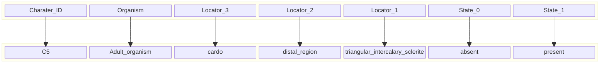
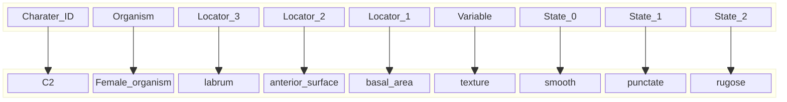
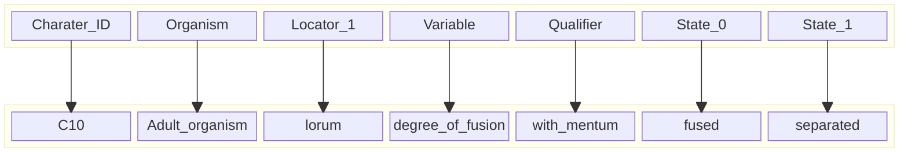

# Phylo Parser: Ontology-Aware Phylogenetic Character Parser

[](https://github.com/tsrsilva/phylo-parser/actions)

A Python tool that automatically parses **phenotypic character lists** (TXT) and maps character components to bio-ontologies, producing structured CSV and JSON outputs suitable for **downstream semantic workflows**.

---

## Features

- Parses character statements and states from text files
- Maps terms to **ontology URIs** (AISM, HAO, BSPO, PATO)
- Resolves **synonyms** via ontology queries
- Generates:
  - Structured **CSV outputs**
  - Nested, semantically meaningful **JSON outputs**
  - Identifies and reports **missing ontology mappings**

---

## Installation for development

Clone this repository and install dependencies locally:

```bash
git clone https://github.com/tsrsilva/phylo-parser.git
cd phylo-parser
pip install -r requirements.txt
```

### Configuration
The pipeline is configured via a YAML file located in ```configs/```. 

Example ```configs/config.yaml```:

```yaml
input:
  data_dir: "data"

resources:
  dicts_dir: "dicts"

output:
  csv_dir: "output_csv"
  json_dir: "output_json"
  missing_dir: "missing_uris"
```

This file controls where input data and resources (dictionaries) are read from and where outputs are written.

## Usage

For most collaborators, the easiest way to run the tool is using Docker. This ensures consistent dependencies and paths, without requiring local Python setup.

### Option 1: Using Docker Compose (recommended)

```bash
docker compose build
docker compose run --rm phylo-parser
```

This will:

- Build the Docker image
- Run the container
- Automatically:
    - Load the ontologies 
    - Parse all ```.txt``` files in ```data/``` 
- Generate outputs in:
    - ```output_csv/```
    - ```output_json/```
    - ```missing_uris```

No extra volume mounts or Docker commands are required.

### Option 2: Building the Docker image manually

```bash
docker build -t phylo-parser .
docker run --rm phylo-parser
```

Using Option 1 or 2 is recommended to avoid manual volume mounts and ensure consistent input/output paths.

### Option 3: Running locally without Docker (not recommended)

If you prefer to run natively on Python:

```bash
python phylo_parser/main.py
```

- Ensure all dependencies from ```requirements.txt``` are installed (or from ```environment.yml``` if using conda)
- Make sure the ```data/```, ```configs/```, and ```dicts/``` directories exist in the project root
- Outputs will be saved according to the paths defined in configs/config.yaml

## Output overview

### CSV outputs

- Character part tables
- State part tables
- Combined character-states tables

### JSON outputs

- Structured phenotype representations:
    - Organism
    - Locators
    - Variable (when applicable)
    - States
    - Statement type tag (neomorphic, transformational simple, transformational complex)

### Missing terms

- CSV listing terms without ontology URIs

## Project structure

```graphql
root/
├── phylo_parser/           # Main Python package with source code
├── data/                   # Input character list files (.txt)
├── dicts/                  # Ontology and synonym dictionaries
├── configs/                # YAML configuration files
├── output_csv/             # Generated CSV outputs
├── output_json/            # Generated JSON outputs
├── missing_uris/           # Missing ontology term reports
├── LICENSES/               # License files (MIT)
├── pyproject.toml          # Build configuration and dependencies
├── environment.yml         # Conda environment for development
├── requirements.txt        # Python dependencies
├── docker-compose.yml      # Orchestrates Docker services for reproducible runs
├── Dockerfile              # Container build definition
└── README.md               # Project documentation
```

## Example data

A minimal example data file can be found at ```data/examples/minimal.txt```. The file consists of ten character statements (character + states) obtained from Roig-Alsina & Michener (1993) and adjusted to conform with a modified version of Sereno's (2007) character syntax. The modified syntax is organised in three different types of statements: neomorphic, transformational simple, and transformational complex.

### Neomorphic statement

Example:
```
C5. Adult organism, cardo, distal region, triangular intercalary sclerite: absent (0); present (1).
```



### Transformational simple statement

Example:
```
C2. Female organism, labrum, anterior surface, basal area, texture: smooth (0); punctate (1); rugose (2).
```



### Transformational complex statement

Example:
```
C10. Adult organism, lorum, degree of fusion [with mentum]: fused (0); separated (1).
```



## References

- Roig-Alsina A, Michener CD. 1993.
Studies of the phylogeny and classification of long-tongued bees. University of Kansas
Science Bulletin, 55:124–162
- Sereno PC. 2007. Logical basis for morphological characters in phylogenetics. Cladistics, 23(6): 565–587.

## License

Licensed under the [MIT License](/LICENSES/MIT.txt)
© 2026 Thiago S. R. Silva, Diego S. Porto

## Funding

This tool was developed as part of the project “PhenoBees: a knowledgebase and integrative approach for studying the evolution of morphological traits in bees” funded by the Research Council of Finland (grant #362624).

## Authors
- [Thiago S. R. Silva](https://github.com/tsrsilva)
- [Diego S. Porto](https://github.com/diegosasso)
